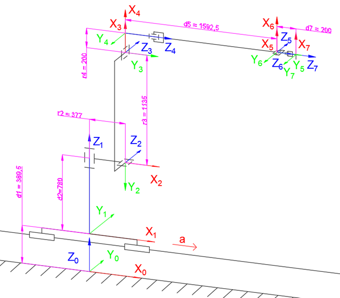

# uiutils
Playing around with Uiua

A bunch of functions and algorithms that seemed fun to implement, mostly split into these categories for now:

### Number operations:
- **Divs:** integer divisors (including self)
- **GCD:** greatest common divisor
- **LCM:** least common multiple
- **Fib:** first n numbers of the Fibonacci sequence
- **Digit:** split integer into digits (with un inverse for joining digits)

### Matrix operations:
- **Mult:** matrix multiplication (with anti inverse for matrix "division")
- **Det:** matrix determinant (using recursion)
- **Inv:** inverse matrix
- **I:** identity matrix of n rank
- **O:** zero matrix of n rank
- **Diag:** turn vector into diagonal matrix

### Image manipulation:
- **Flag:** generate horizontal striped flag based on colours (works with all the built-in pride flags)
- **Spin:** spin (rotate) image clockwise (useful for vertical striped flags)
- **Pad:** pad a matrix/image with a fill value (size of fill must match pixel size)

Also contains a (by no means comprehensive) list of country flag colours as [two-letter codes](https://en.wikipedia.org/wiki/ISO_3166-1_alpha-2)

## Direct Kinematics
`DK.ua` contains an implementation for direct kinematics using the [Denavit-Hartenberg](https://en.wikipedia.org/wiki/Denavit%E2%80%93Hartenberg_parameters) matrix. It was designed for industrial robots, but it should work just as well for any kinematic chain or mechanism. (inverse kinematics are currently on the to-do list)

*Illustration of DH parameters for an ABB IRB 6700-175/3.05 robot*
